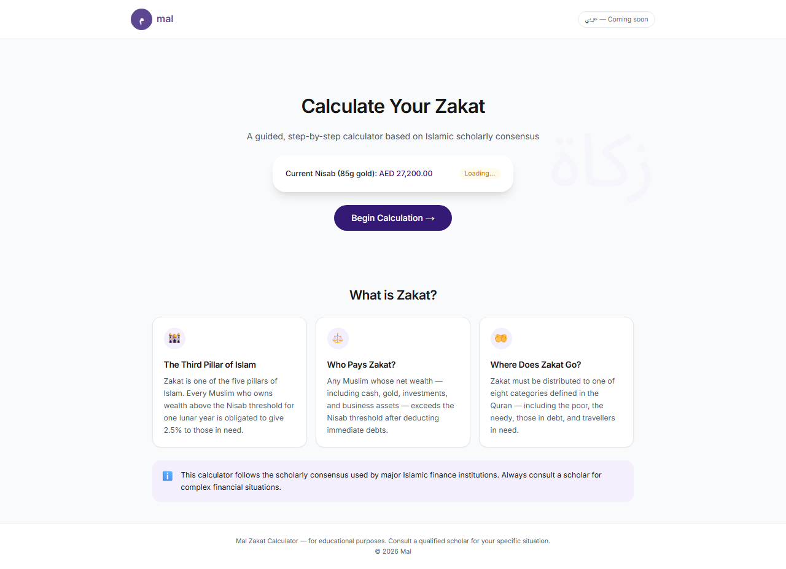

# Mal Zakat Calculator

A guided, conversational Zakat calculator — think TurboTax meets fintech. Walk through your assets step by step and receive a clear breakdown of what you owe.



Flow and architecture diagrams: [`e2e/screenshots/flow-diagram.svg`](e2e/screenshots/flow-diagram.svg), [`e2e/screenshots/architecture-diagram.svg`](e2e/screenshots/architecture-diagram.svg).

## Tech stack


- **Next.js 14** (App Router)
- **TypeScript** (strict mode)
- **Tailwind CSS** with Mal design tokens
- **Jest** + React Testing Library (unit and component tests)
- **Playwright** (end-to-end tests across desktop and mobile viewports)
- No external UI libraries

## Features

- Multi-step wizard for cash, gold, silver, property, investments, business assets, and receivables
- Live gold and silver spot prices with configured fallbacks
- Input sanitization and caps (`validators.ts`, `MAX_ASSET_VALUE`)
- Safe display formatting for large or invalid amounts (`formatAEDSafe`, `AED 10M+` for very large Zakat due)
- Educational **What is Zakat?** section on the homepage (`ZakatInfo`)
- Uncertain receivables can be excluded from zakatable wealth
- Print-friendly result summary

## Getting started

```bash
npm install
npm run dev
```

Open [http://localhost:3000](http://localhost:3000) in your browser.

## Testing

### Unit and component tests (Jest)

```bash
npm test
npm run test:watch   # watch mode
```

### End-to-end tests (Playwright)

Twelve spec files under `e2e/` cover the full wizard flow, validation, security, accessibility, and mobile layouts. Tests run against three viewports: Desktop Chrome (1280×800), iPhone 14, and iPhone SE. Screenshots are written to `e2e/screenshots/` on each run.

```bash
npm run test:e2e          # headless (starts dev server automatically)
npm run test:e2e:headed   # visible browser
npm run test:e2e:report   # open HTML report after a run
npm run test:all          # Jest + Playwright
```

## Architecture decisions

### Wizard flow over a single form

Zakat involves many asset categories with different rules (worn gold vs stored, primary home vs rental income). A linear wizard reduces cognitive load, validates each step, and mirrors how financial guidance products onboard users.

### Lazy-loaded wizard steps

Wizard steps and the homepage `ZakatInfo` section are loaded with `next/dynamic` and skeleton placeholders. This keeps the initial bundle smaller and defers step-specific UI until the user progresses.

### Pure functions in `zakatEngine`

All calculation logic lives in `src/lib/zakatEngine.ts` as side-effect-free functions. A `safeNumber` guard coerces and clamps inputs before math runs. The hook layer only orchestrates user input and calls `calculateZakat`.

### Input validation layer

`src/lib/validators.ts` centralizes `sanitizeNumberInput`, `parseInputValue`, `clampAssetValue`, and `MAX_ASSET_VALUE` (999,999,999 AED). Inputs strip non-numeric characters, reject negatives, and enforce caps in both the UI and engine.

### Live gold price with fallback

`useGoldPrice` fetches XAU/XAG spot prices from [gold-api.com](https://api.gold-api.com), converts USD/troy oz to AED/gram (peg 3.67), and falls back to configured defaults if the API fails. `layout.tsx` preconnects to the API host; CSP allows `connect-src` to that origin. The UI shows **Live price** vs **Estimated price** badges so users know data freshness.

### Safe currency display

`formatAEDSafe` handles non-finite values and clamps display to `MAX_ASSET_VALUE`. Very large Zakat due amounts render as **AED 10M+** with a note to consult a scholar; totals above the asset cap show a wealth-cap warning on the result step.

### i18n scaffold for Arabic

Inter handles English UI today; Noto Sans Arabic is loaded in `layout.tsx` for future RTL support. The header includes a disabled **عربي — Coming soon** toggle as a scaffold.

### Accessibility

Secondary and helper text use `text-mal-gray-dark` (`#4B5563`) for WCAG-compliant contrast on white backgrounds. Playwright spec `12-accessibility.spec.ts` checks keyboard navigation and axe violations on key steps.

## Project structure

```
src/
  app/           # Next.js routes and global styles
  components/
    wizard/      # Step components (orchestrated from page.tsx)
    ui/          # Design system primitives, ZakatInfo
    layout/      # Header, Footer
  hooks/         # useZakatCalculator, useGoldPrice
  lib/           # Engine, formatters, validators, constants
  types/         # Shared TypeScript types
  __tests__/     # Unit and component tests
e2e/             # Playwright specs and screenshot artifacts
```

## Known limitations

- Scholarly positions differ on worn gold, stock zakatable portions, and debt deductions — this tool uses commonly cited simplified rules.
- gold-api.com availability may vary; fallback prices are used when live data fails.
- Hawl (one lunar year above Nisab) is disclosed but not validated in the flow.
- Arabic UI is not yet implemented.
- Asset values are capped at 999,999,999 AED; very large Zakat due is summarized as **AED 10M+** rather than an exact figure.
- Uncertain receivables are excluded from zakatable wealth when the user selects that option; repayable receivables are included.

## Deployment

Configured for [Vercel](https://vercel.com) via `vercel.json` (Next.js framework preset). Production builds use `npm run build`. Run the same command locally to verify before deploy.

## Built with Mal's design system

Purple palette (`#351A75`), rounded cards, and conversational copy aligned with Mal brand guidelines.
